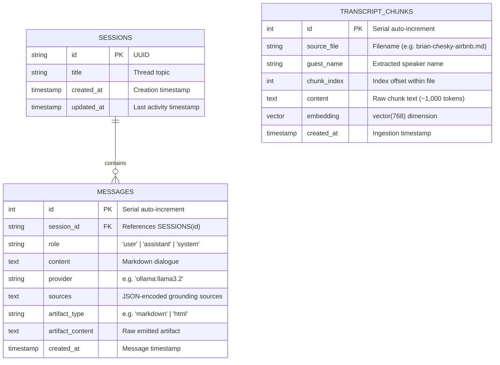
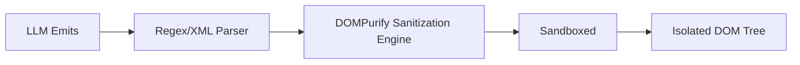

# System Architecture Specification
## The Lenny Growth Assistant

**Version:** 1.0.0  
**Author:** Lead Forward Deployed Engineer  

---

## 1. System Topology Overview

The Lenny Growth Assistant is architected as a modular, 4-tier containerized topology orchestrating persistent storage, vector search, local/cloud LLM inference, and an editorial split-view frontend.

```mermaid
flowchart TD
    subgraph Client ["Browser Client (Port 3000)"]
        UI["React 18 + Tailwind v4 Canvas"]
        Drawer["Sandboxed Artifact Drawer (DOMPurify + Iframe)"]
        UI <--> Drawer
    end

    subgraph ReverseProxy ["Nginx Web Server"]
        Nginx["Nginx Reverse Proxy (:80)"]
    end

    subgraph BackendApp ["FastAPI Backend (Port 8000)"]
        API["REST API Routes & Middleware (/healthz, /api/v1)"]
        Orchestrator["Agent Orchestrator & Epistemic Gate"]
        Bridge["Dual-LLM Provider Bridge"]
        Retriever["Semantic RAG Retriever"]
        API --> Orchestrator
        Orchestrator --> Retriever
        Orchestrator --> Bridge
    end

    subgraph Persistence ["Storage & AI Daemon"]
        DB[("PostgreSQL 16 + pgvector (:5432)")]
        Ollama["Ollama Daemon (:11434)\nllama3.2 + nomic-embed-text"]
        Claude["Anthropic Cloud API\n(claude-3-5-sonnet-latest)"]
    end

    UI --> Nginx
    Nginx -->|/api/*| API
    Nginx -->|/healthz| API
    Retriever -->|vector_cosine_ops| DB
    API -->|Session & Message ORM| DB
    Bridge -->|HTTP REST (15s timeout)| Ollama
    Bridge -.->|Async SDK| Claude
```

### ASCII Architecture Map

```text
[ Browser Client ]
       │
       ▼ (:3000 -> :80)
[ Nginx Reverse Proxy ]
       │
       ▼ (:8000)
[ FastAPI Backend Application ]
   ├── Telemetry Middleware (X-Request-ID, Latency)
   ├── Agent Orchestrator (Multi-turn Context, Grounding Gate)
   ├── Semantic Retriever (pgvector Cosine Ops)
   └── Dual-LLM Bridge (Ollama Llama 3.2 ⟷ Anthropic Claude 3.5)
       │                        │
       ▼ (:5432)                ▼ (:11434)
[ PostgreSQL 16 + pgvector ]   [ Ollama Daemon ]
 (Sessions, Messages, Chunks)   (nomic-embed-text, llama3.2)
```

---

## 2. Database Schema & Entity Relationships

The relational schema is managed via PostgreSQL 16 with the `vector` extension.



### Indexing Strategy
1. **IVFFlat Cosine Index**:
   ```sql
   CREATE INDEX idx_transcript_chunks_embedding 
   ON transcript_chunks 
   USING ivfflat (embedding vector_cosine_ops) 
   WITH (lists = 100);
   ```
2. **B-Tree Metadata Indexes**:
   - `idx_transcript_chunks_source_file` for file filtering.
   - `idx_transcript_chunks_guest_name` for guest-scoped queries.
   - Unique index `uq_source_chunk (source_file, chunk_index)` to ensure idempotent re-ingestion.

---

## 3. Dual-Model Bridge Architecture

The system enables dynamic runtime model switching without environment variables or service restarts:

1. **Local Ollama Path**:
   - **Chat Model**: `llama3.2`
   - **Embedding Model**: `nomic-embed-text` (768 dimensions)
   - **Interface**: REST API (`/api/generate` and `/api/embeddings`)
   - **Resilience**: Configured with a strict 15.0-second timeout. If the daemon is unreachable or overloaded, returns a structured HTTP 504 / 503 error payload rather than crashing.
2. **Cloud Anthropic Path**:
   - **Model**: `claude-3-5-sonnet-latest`
   - **Interface**: Official Anthropic Python SDK (`anthropic.AsyncAnthropic`)
   - **Fallback Behavior**: If `ANTHROPIC_API_KEY` is not set, the UI and API seamlessly default to local Ollama.
   - **Security**: Raw API keys are never logged, serialized, or exposed to the client.

---

## 4. Chunking & Strict Grounding Strategy

- **Token-Aware Splitting**: Uses `RecursiveCharacterTextSplitter.from_tiktoken_encoder` with `cl100k_base` encoding:
  - `chunk_size = 1,000 tokens`
  - `chunk_overlap = 150 tokens`
  - `separators = ["\n\n", "\n", ". ", " ", ""]`
- **Speaker Attribution**: Every chunk retains exact guest and episode metadata.
- **Epistemic Threshold Cutoff (`>= 0.65`)**:
  - Distance query: `1 - (embedding <=> query_vector) >= 0.65`.
  - If no candidate chunks meet the 0.65 threshold, the orchestrator immediately returns:
    `"The available podcast transcripts do not cover this specific question."`

---

## 5. Sandboxed Iframe Security Model

Untrusted HTML artifacts generated by LLMs represent a potential Cross-Site Scripting (XSS) and data exfiltration vector. The Lenny Growth Assistant enforces a zero-trust multi-layer defense:



### Security Directives
1. **DOMPurify Sanitization**: All HTML is scrubbed of dangerous attributes (`onload`, `onerror`) and unauthorized external protocols prior to insertion.
2. **Iframe Isolation (`sandbox="allow-scripts"`)**:
   - **NO `allow-same-origin`**: The iframe runs with an opaque origin (`null`), strictly preventing access to parent cookies, local storage, session storage, or the parent document DOM.
   - **NO `allow-top-navigation`**: The sandboxed content cannot redirect or hijack the parent window.
   - **Clean CSS Reset**: The iframe receives an isolated CSS stylesheet, preventing styling leaks or CSS injection into the main application.
